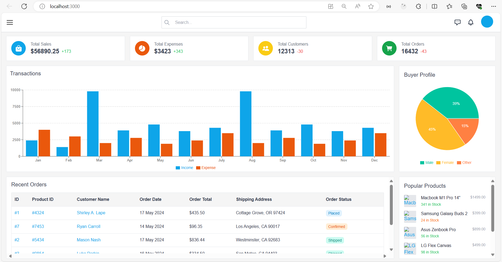
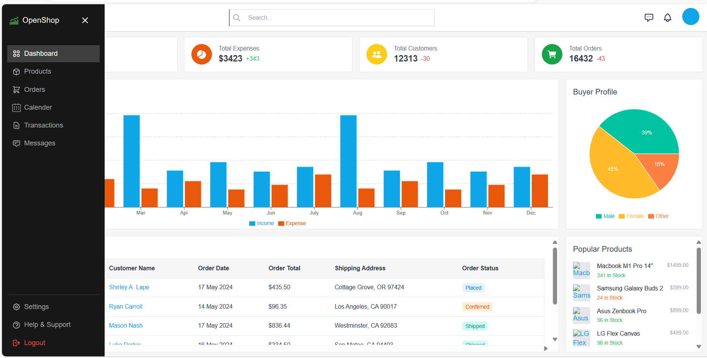
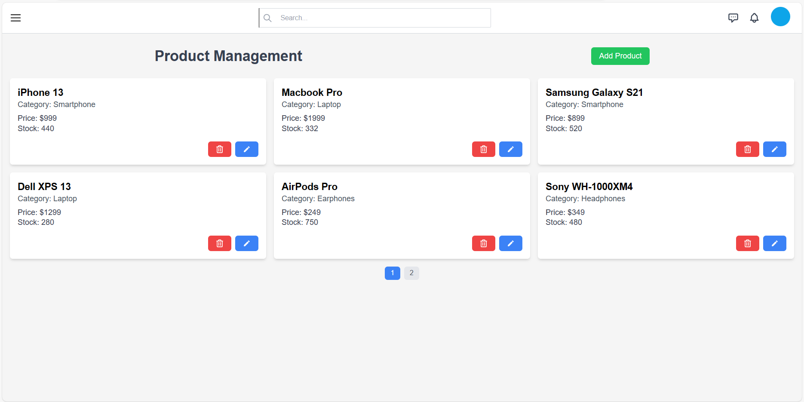
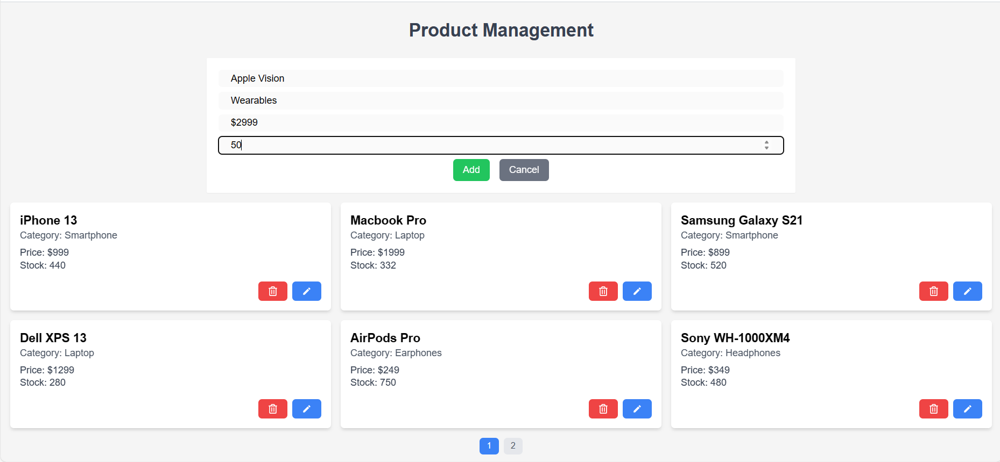
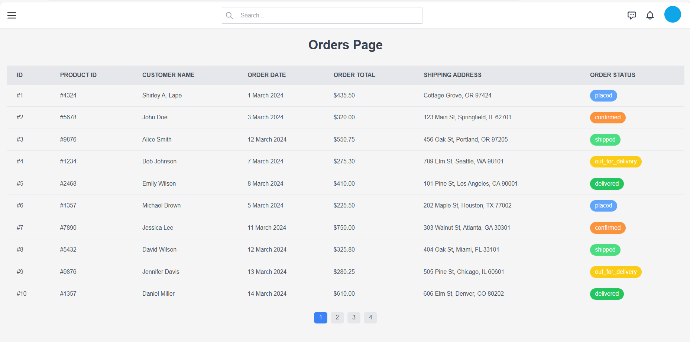
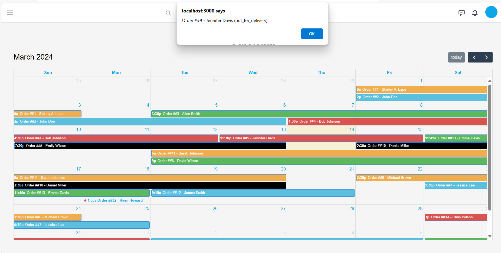
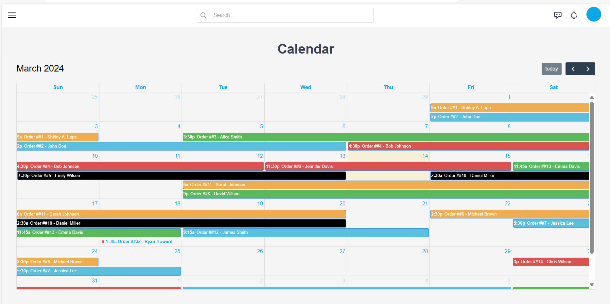

# ERP System

## Overview

This repository contains the source code for an ERP (Enterprise Resource Planning) system built with React.js. It includes various npm packages and dependencies to enhance functionality and user experience.

## Installation

## Setup Instructions:

1. Clone the repository to your local machine.
2. Install Node.js if you haven't already.
3. Navigate to the project directory.
4. Run `npm install` to install dependencies.
5. Configure Tailwind CSS using `npx tailwindcss init`.

To install the necessary packages and libraries, use the following npm commands:

These instructions should provide users with clear guidance on how to set up and interact with your website.

1. **create-react-app:**
   ```
   npm install -g create-react-app
   ```

2. **tailwindcss:**
   ```
   npm install tailwindcss
   ```

3. **configure tailwindcss:**
   ```
   npx tailwindcss init
   ```

4. **react-router-dom:**
   ```
   npm install react-router-dom
   ```

5. **headless ui:**
   ```
   npm install @headlessui/react
   ```

6. **react icons:**
   ```
   npm install react-icons
   ```

7. **date-fns:**
   ```
   npm install date-fns
   ```

8. **moment:**
   ```
   npm install moment
   ```

9. **Recharts:**
   ```
   npm install recharts
   ```

10. **Classnames:**
   ```
   npm install classnames
   ```

## Dependencies

### Core Dependencies

- **React:** A JavaScript library for building user interfaces.
- **React DOM:** Entry point for working with the DOM tree.
- **React Router DOM:** Declarative routing for React applications.
- **React Icons:** Icons library for React applications.
- **Tailwind CSS:** A utility-first CSS framework for rapidly building custom designs.

### Additional Libraries

- **@fullcalendar/interaction:** Interactivity plugin for FullCalendar.
- **@headlessui/react:** Accessible UI components for React applications.
- **Date-fns:** Modern JavaScript date utility library.
- **Moment:** Parse, validate, manipulate, and display dates and times in JavaScript.
- **Recharts:** A composable charting library built on React components.
- **Classnames:** A simple JavaScript utility for conditionally joining classNames together.

## Interacting with the Website:

1. Start the development server with `npm start`.
2. Access the website by opening your browser and navigating to [http://localhost:3000](http://localhost:3000).
3. Explore different modules using the navigation menu.
4. Enter data and interact with forms and input fields to update records in `Products` page.
5. Access the calendar module to view the due orders on a particular date.

## Screenshots

### Dashboard


### Navigation Sidebar


### Products Page


### Add Products


### Orders Page


### Due orders on a particular date


### Calendar


## Usage GIF
